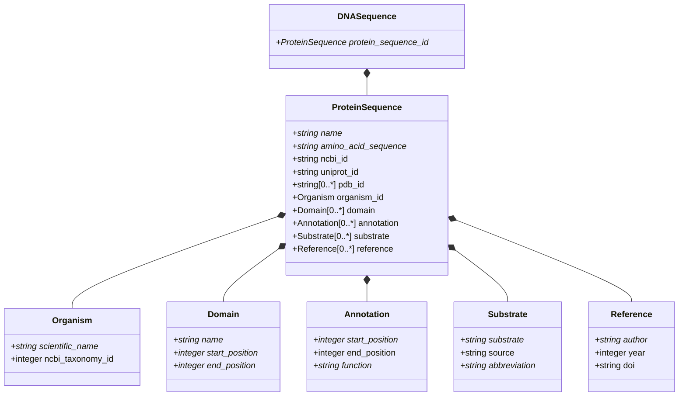

```mermaid
classDiagram
    ProteinSequence *-- Organism
    ProteinSequence *-- Domain
    ProteinSequence *-- Annotation
    ProteinSequence *-- Substrate
    ProteinSequence *-- Reference
    DNASequence *-- ProteinSequence
    
    class ProteinSequence {
        +string name*
        +string amino_acid_sequence*
        +string ncbi_id
        +string uniprot_id
        +string[0..*] pdb_id
        +Organism organism_id
        +Domain[0..*] domain
        +Annotation[0..*] annotation
        +Substrate[0..*] substrate
        +Reference[0..*] reference
    }
    
    class Organism {
        +string scientific_name*
        +integer ncbi_taxonomy_id
    }
    
    class Domain {
        +string name*
        +integer start_position*
        +integer end_position*
    }
    
    class Annotation {
        +integer start_position*
        +integer end_position
        +string function*
    }
    
    class DNASequence {
        +ProteinSequence protein_sequence_id*
    }
    
    class Substrate {
        +string substrate*
        +string source
        +string abbreviation*
    }
    
    class Reference {
        +string author*
        +integer year
        +string doi
    }
    
```